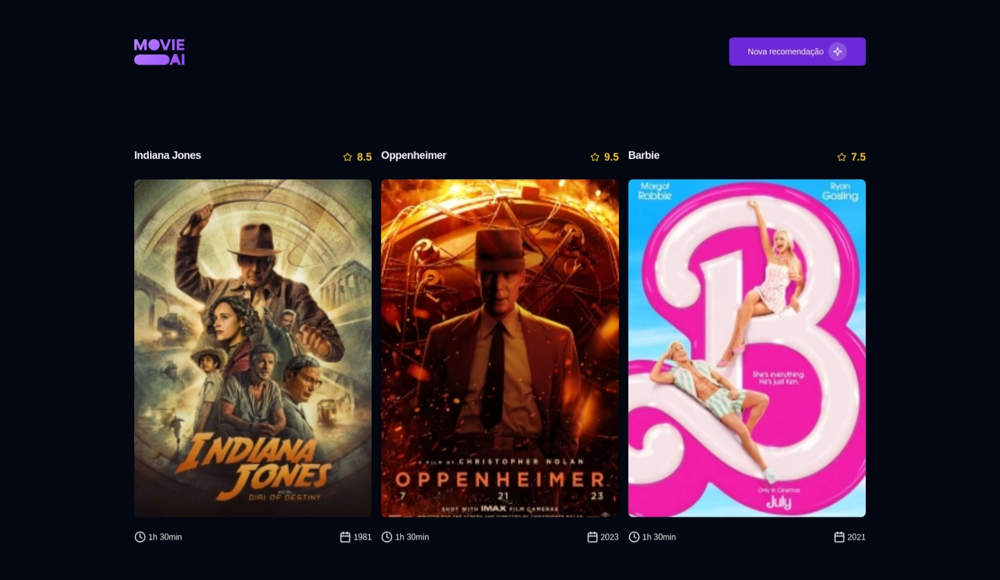

# MOVIE AI | Personal Project

**MOVIE AI** is a web application for movies suggestions with Google Gemini AI.

> Status: Finished... ✅

## Technologies 🚀

## Libs 📕

📑 **ZOD**

📑 **REACT HOOK FORM**

📑 **LUCIDE ICONS**

📑 **BIOME JS**

📑 **AXIOS**

## Features 💡

✅ **SUGGEST MOVIE**

## License 📝

